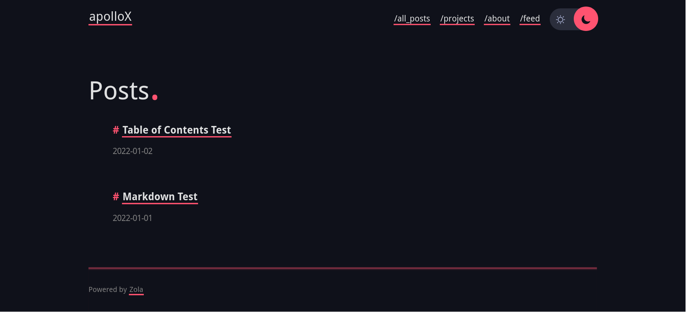
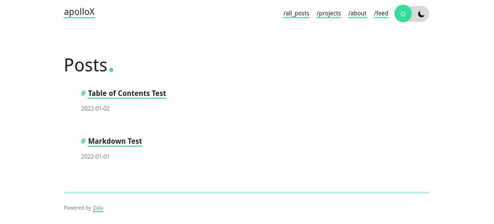

# apollo

Modern and minimalistic blog theme powered by [Zola](getzola.org). See a live preview [here](https://not-matthias.github.io/apollo).

<sub><sup>Named after the greek god of knowledge, wisdom and intellect</sup></sub>

<details open>
  <summary>Dark theme</summary>
  
  
</details>

<details>
  <summary>Light theme</summary>
  

</details>

## Features

- [X] Pagination
- [X] Themes (light, dark, auto)
- [X] Analytics using [GoatCounter](https://www.goatcounter.com/)
- [x] Social Links
- [ ] Search
- [ ] Categories

## Installation

1. Download the theme
```
git submodule add https://github.com/not-matthias/apollo themes/apollo
```

2. Add `theme = "apollo"` to your `config.toml`
3. Copy the example content

```
cp themes/apollo/content content
```

## Options

### Additional stylesheets

You can add stylesheets to override the theme:

```toml
[extra]
stylesheets = [
    "override.css",
    "something_else.css"
]
```

These filenames are relative to the root of the site. In this example, the two CSS files would be in the `static` folder.

## References

This theme is based on [archie-zola](https://github.com/XXXMrG/archie-zola/).  
